# 방구석 챌린지

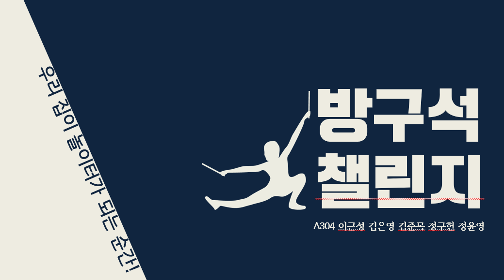

## 기획의도

> 작년 2019년 12월 중국 우한을 시작으로 현재까지 전 세계적으로 확산된 코로나 19로 인한  
> `코로나 팬데믹`이 이어지고 있습니다. 많은 사람들이 거리두기 운동에 동참하며  
> 점차 잠잠해지던 한국도 PC방, 노래방 등 유흥 시설을 기점으로 다시 확산되며 위기 상황에 맞닿았습니다.
>
> 이러한 위기는, `언택트 문화`라는 사회적 변화를 일으키며, 온라인 개학 및 재택 근무 증가 등 비대면 환경이 조성되었습니다.
> 또한 가정의 웹 캠, 노트북 등을 활용한 화상 통화등을 적극 활용하는 IT 인프라 또한 크게 개선되었습니다.
>
> 언택트 문화 및 규제 온화로 글로벌 게임 시장 성장과 함께 국내 게임 산업 및 스타트업 지원이 확대 되는 등,  
> 다른 산업에 비하여 게임 산업의 성장세가 돋보이고 있습니다.
>
> 저희는 사회적 분위기의 흐름과 함께 이러한 기회를 놓치지 않기 위하여, 별도의 설치 필요 없이 집에서도 안전하게 질길 수 있는 게임을 제공하는 `방구석 챌린지` 게임 포털 서비스를 만들었습니다.

## 주요 기능

- 별도의 설치가 필요없어 부담 없이 즐길 수 있는 웹 기반 게임

- 피트런

  - 센서 장비 없이 웹캠 만으로 이용할 수 있는 모션 인식 피트니스 게임
  - 머신러닝을 활용한 자세 정확도 판단

- 마피아
  - 다중 화상 통화 방을 활용한 비대면 게임

## 주요 사용 기술

- 프론트 엔드
  - vue.js
  - vuex
  - vue router
  - webRtc
  - quasar.js
  - Teachable Machine
  - Tensorflow.js
- 백 엔드
  - **[백엔드 관련](back/back-spring/ReadMe.md)**
  - spring boot
  - mysql
  - mybatis
  - janus-gateway
  - firebase auth

## 게임 소개

### 1. 피트런

#### Fitness Pose Estimation

##### 개요

- 모션 인식 기술을 바탕으로 홈트레이닝과 게임을 결합한 서비스

- Posenet, Teachable Machine, Tensorflow.js 를 활용한 전문가의 운동 동작 학습

- 게임 유저의 동작을 인식하여 포즈 정확도를 판단

 

##### Trained Pose Model

1. Walk

   - 준비 동작 시
   - 두 무릎을 높이 들어 걸이면 walk, 두 팔을 양옆으로 벌리면 Jump, 멈추면 Stop 하는 동작을 인식한다.

   | stop                                   | right                                                                      | left                                   | jump                                                                      |
   | -------------------------------------- | -------------------------------------------------------------------------- | -------------------------------------- | ------------------------------------------------------------------------- |
   | 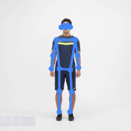 | 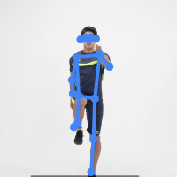 | 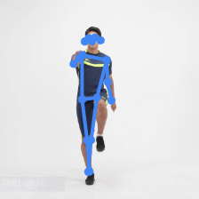 | 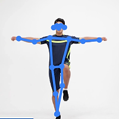 |

2) Shoulder Press

   - 몬스터 공격 동작 1
   - 팔을 높게 든 후 90도를 유지하도록 팔을 내렸다가 다시 올리는 동작을 반복한다. 팔을 올릴 때, 어깨가 따라 올라가지 않도록 유의한다.

   | down                                       | middle                                       | up                                       |
   | ------------------------------------------ | -------------------------------------------- | ---------------------------------------- |
   | 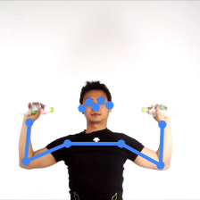 | 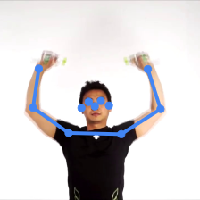 | 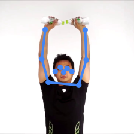 |

3. Side Lunge

   - 몬스터 공격 동작 2

   - 두 다리를 옆으로 벌린 상태로 무릎을 번갈아가며 굽힌다. 이 때, 허리를 펴기보다 무게중심을 뒤로 두어 무릎에 무리가 가지 않도록 한다.

   | middle                                    | right                                    | left                                    |
   | ----------------------------------------- | ---------------------------------------- | --------------------------------------- |
   | 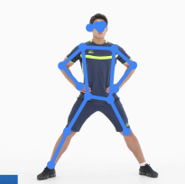 | 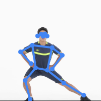 | 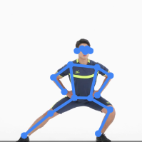 |

4) Side Crunch

   - 몬스터 공격 동작 3

   - 깍지 낀 손을 뒷통수에 댄 후 팔꿈치와 무릎이 만나도록 다리를 들어 올린다. 앞으로 숙이지 않게 허리를 구부린다.

   | stand                                   | right                                  | left                                     |
   | --------------------------------------- | -------------------------------------- | ---------------------------------------- |
   | 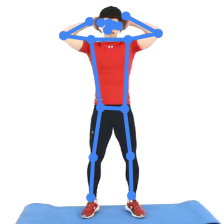 | 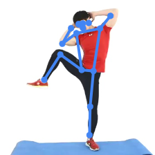 | 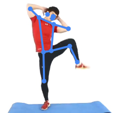 |

5. Squat

   - 몬스터 공격 동작 4

   - 다리를 어깨 너비만큼 벌린 채로 앉았다 일어난다. 이 때, 무릎이 발 끝을 나가지 않도록 하고 허리를 앞으로 굽히지 않는 정확한 자세일 때, count 가 증가한다.

   | stand                                    | middle                                 | sit(squat)                             |
   | ---------------------------------------- | -------------------------------------- | -------------------------------------- |
   | 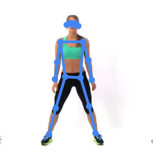 | 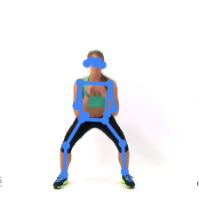 | 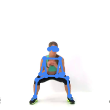 |

6) Jumping Jack

   - 몬스터 공격 동작 5

   - 팔과 다리를 벌렸다가 모으면서 제자리 점프를 한다.

   | down                                   | middle                                | up                                    |
   | -------------------------------------- | ------------------------------------- | ------------------------------------- |
   | 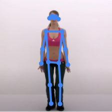 | 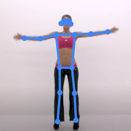 | 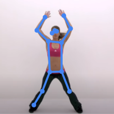 |

#### 피트런 게임 화면 구성

1. Stage 선택

   - 첫 게임 가입 시, Practice 모드가 진행
   - Practice 모드가 완료되면 Stage 선택 가능
   - 하나의 Stage는 3가지의 운동 동작으로 이루어짐

   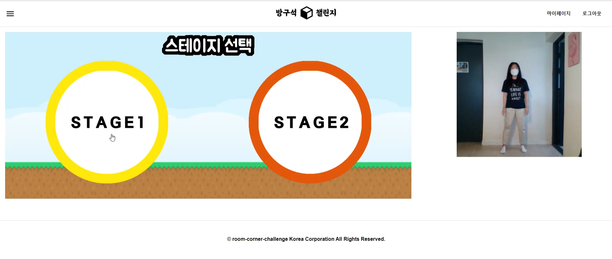

2. 준비 트랙

   - Walk 동작(제자리 걷기) 시, 캐릭터 전진
   - 몬스터와 충돌 시, 게임 모드 전환

   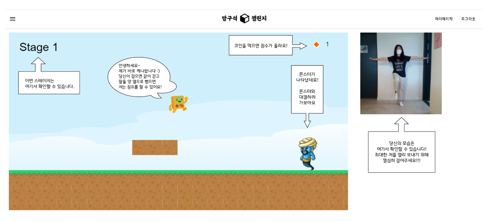

3) 공격 모드

   - 주어진 피트니스 동작으로 몬스터 공격
   - 자세의 정확도에 따라, Perfect, Great, Good, Bad 로 표시

   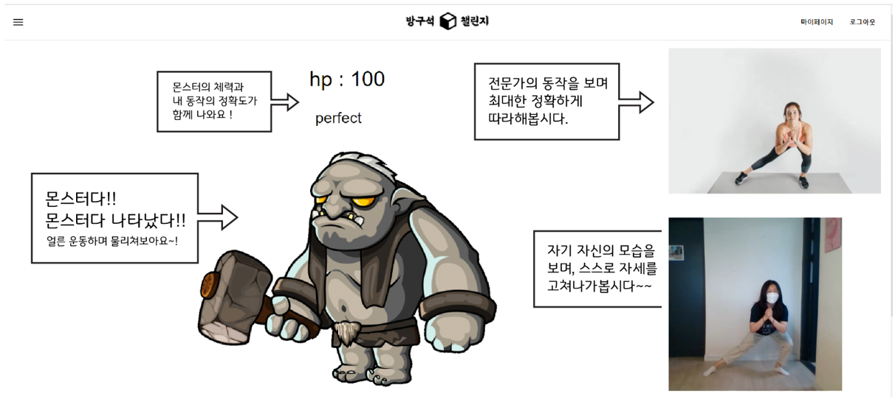

4) 결과 종료 화면

   - 모든 몬스터와 공격을 마치고 Stage 종료 시, 결과 화면

   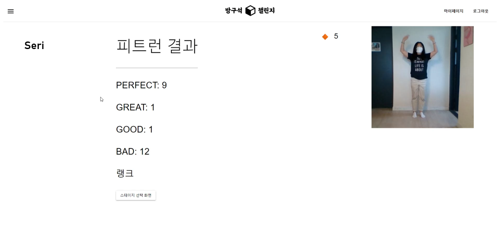
