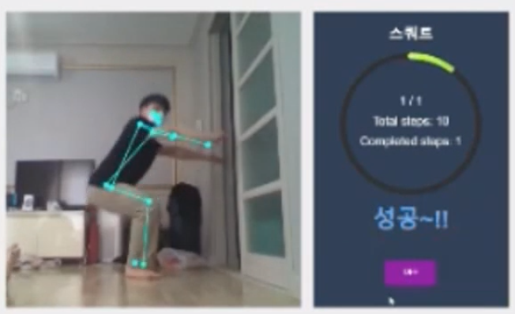
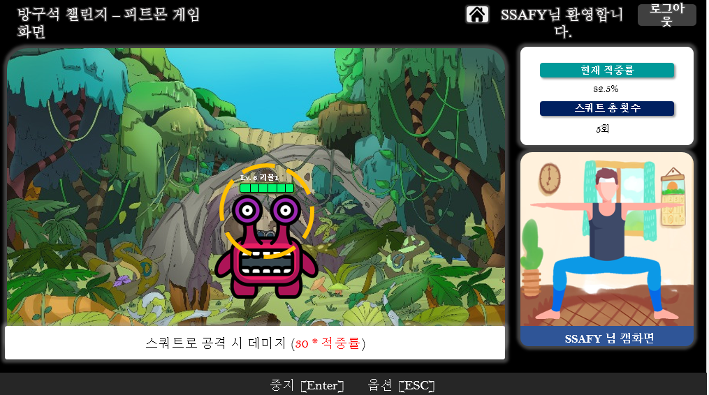
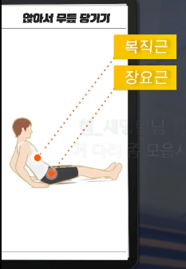
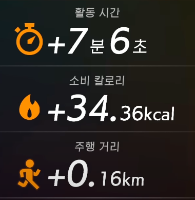
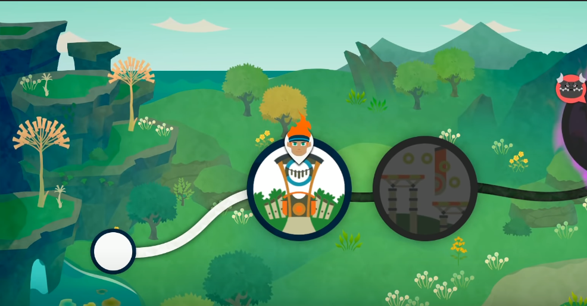
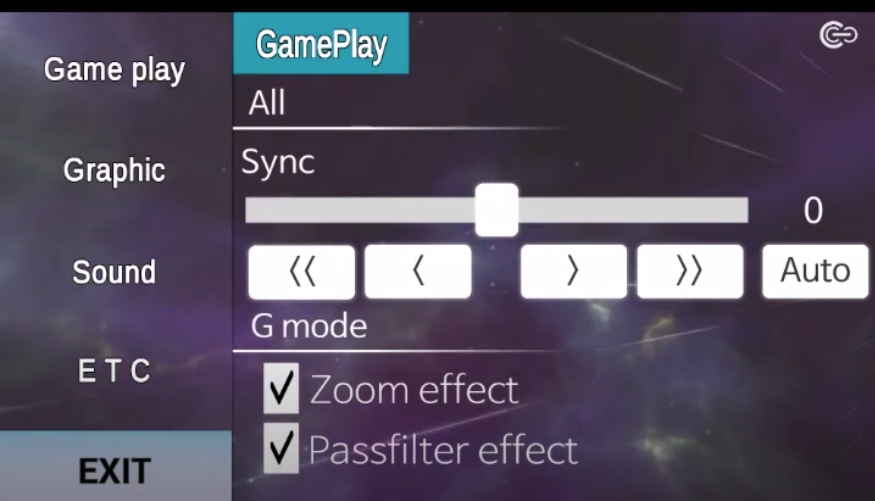

# 기획

비슷한 서비스

​	WAVE 앱 ( https://play.google.com/store/apps/details?id=me.togather.wave&hl=ko )

​		- 영상통화를 하면서 친구들과 함께 다양한 게임을 즐김

##### 우리 서비스의 차별점

- WAVE 는 "영상"을 통해 함께 한다는 것이 초점이라면, 우리 서비스는 "영상"에 "모션인식"이 결합된 게임을 할 수 있다는 것.
- 단순히 앉아서 말로만 하는 게임이 아닌, 방 안에서 움직임을 통해 운동도 된다!

## 1. 링피트(가제: 피트몬)

  다양한 웨이트 트레이닝 동작을 인식하여, 정확한 동작 시 상대 캐릭터를 공격한다.

##### 유사서비스

링피트 어드벤쳐

​		써클링과 센서를 이용한 피트니스 운동 게임

### Story

1. 시작 전 설정

   - 강도 선택 (상 중 하 / 강도 이름을 재밌게 지어도 좋을 듯함)

     강도에 따라 

     ​	1set 운동 횟수를 다르게 설정

     ​	같은 동작이어도 쉬운 동작으로 설정 (ex. 니푸쉬업, 하프스쿼트 등)

   - 운동 부위 선택 (전신, 하체, 상체 등)

2. 게임 시작 버튼

3. 모션 인식을 위한 주의 문구

4. 제자리 걷기로 워밍업 (stage 이동 시, 제자리 걷기)

   제자리 걷기를 하는 동안, 다음 stage 동작에 대한 설명 문구 보여주기

5. Stage 시작 (해당 동작 실시)

   - 10~30 회 씩 3세트

   - 사용자 동작 화면

   

   

   ​			출처: SSAfitness Ucc(위) 및 우리 팀 와이어 프레임워크(아래)

   - 동작 횟수 및 정확도(적중률 화면 표시)

     - 동작 횟수를 단순 숫자가 아닌  damage bar 처럼 시각적으로 나타내면 좋을 것 같음
     - 정확도 판단 방법
       - 학습한 정확한 자세
       - 단계가 올라갈 수록 자세 유지 시간도 측정 (ex. 스퀕자세에서 앉아있을때 몇초 유지 등)

   - 공격

     정확한 동작일 시, 유효 공격 표시하며 몬스터 캐릭터 점점 희미하게(애니메이션 효과 가능하면, 몬스트 쓰러지는 단계 모습으로 표시,,)

   - 타이머

     제한 시간 내에 동작을 실시하도록 타이머 

   - 운동 효과 명시

     운동 효과를 명시함으로써, 더 의욕 불타오르게 하기

     예를 들어 복근 강화 등  정확한 근육에 대해서 알려주기

     

   

   

   

6.  한 Stage 종료 후

   - 소요 시간, 소비 칼로리 알려주기

     

### Stage 설정

기존 게임처럼, 단계별 stage를 표시 하거나

아니면 동작별 게임을 자유롭게 순서를 선택해서 시작해서 했던 동작 게임을 못하게 하던가

### 단계별 동작 구성

1. 기본 스트레칭

2. 스쿼트

   기본스쿼트

   와이드 스쿼트

   점프스쿼트

​	2. 런지

​	3. 플랭크

​	4. 푸시업

	5. 윗몸일으키기
 	6. 브릿지

등등

*상체, 하체, 전신 운동 구분 필요*

### Story 요약

만약, 화면 이동이 가능하다면

 1. 제자리 걷기로 Stage이동

 2. stage 별 동작

 3. 10~20 회 씩 3세트

 4. 다른 스테이지로 이동 시 제자리 걷기

### Player 수에 따른 전략

##### 1인 게임

​	위의 스토리 대로 게임

##### 2인 게임

같은 속도로 동작 + 둘 다 정확할 시에만 공격 point

​	

​	

## 2. 리듬게임(가제: BeatHitIt )

#### 무료 음원 사이트

- 유투브 오디오 라이브러리
- 공유마당 (https://gongu.copyright.or.kr/gongu/main/main.do)
- 벤사운드 (퀄은 좋으나 종류 많지 않음, https://www.bensound.com/)

-  Mewpot (효과음도 있음, 효과음은..무료 잘 없음.., https://www.mewpot.com/)

### 짚어야할 점

1. 박자 or 멜로디 비트 싱크 맞추기

   (리듬 게임은 리듬을 바탕으로 진행되야함)

   참고 url - https://www.youtube.com/watch?v=NZxMsEKdjbM&list=PLRx0vPvlEmdDySO3wDqMYGKMVH4Qa4QhR&index=14
   
   

### Story

1. 음악 선택

   각 음악 장르, 레벨, 시간 등 표시

2. 음표 or 원판 같은거 날아오면 손으로 치기

   기존의 많은 리듬게임처럼

   ​	Perfect, Good, Bad, Miss 로 나누어서 판단

3. 게임 종료 후

   perfect, good, bad, miss 의 갯수

   총점

   랭킹

   

### 게임 버전

1. 캐치볼 처럼 물체 터치
2. 상체 or 팔로 하는 DDR

### 페이지 참고

- tutorial 가이드 페이지

  tutorial 게임이 있으면 좋을 것 같음

- Setting

  - 날라오는 물체들의 모양을 Customize

  - Graphic 설정
- Sound  설정
  
  

## 3. 마피아

##### 유사 게임

​	< 마피아 42 >

​	특징

  - 지목 투표 시스템

  - 투표 전 유언 작성

  - 마지막에 mvp 선정

  - 다양한 직업 종류

    마피아, 경찰, 의사, 스파이, 기자, 군인 등

< 한밤의 늑대 인간 >

- 직업 카듬다 각기 다른 능력이 존재
- 능력을 익히고  사용해야함

### 방구석 마피아  필요한 점

- 기본 마피아 게임일 경우

  - 인원

    - 최소 ~ 최대 게임 참여 인원 설정

    - 인원 마다 마피아 수 설정

      ex) 5명 참여시, 마피아 2명 경찰 1명 의사 1명 시민 1명 

  - 플레이 타임

    - 1play 시간 설정 (저녁이 올때까지 몇 분을 1 play 로 볼 것인가 )

    - 플레이 횟수 ( 한 게임당 몇 회를 플레이 할 것인가, 몇번의 밤을 보낼 것인가)

    

- Upgrade 마피아 게임

  - 다양한 직업 설정

    - 직업 추리

      : 게임 시작 시 or 중간에 각 player 들의 직업을 추리해서 게임 종료 시 추리 정확도 비율이 높으면 추가 point 등

    - 능력 추가하기

## Ranking 제도

### 게임 별 Ranking

### 종합 Ranking

