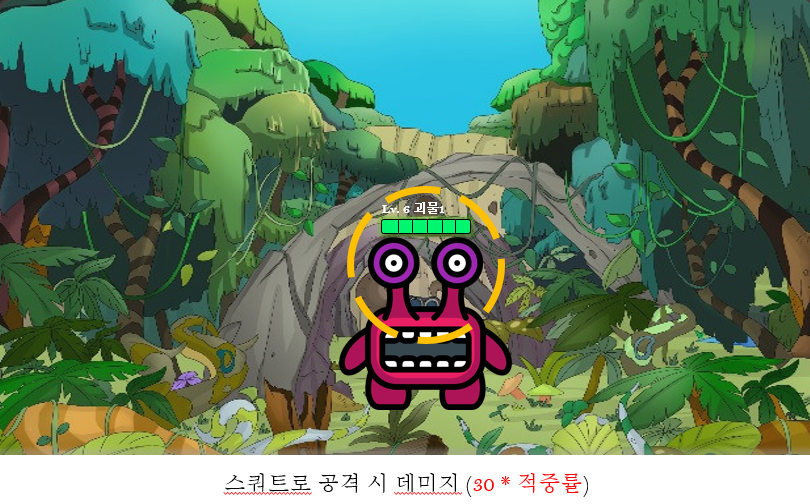
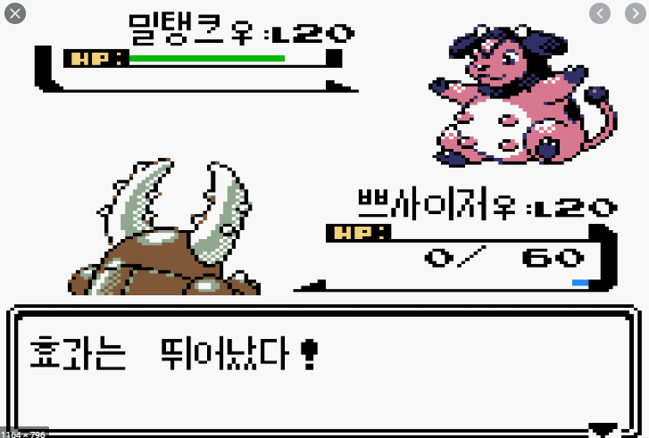

# 링피트

## 현재

- Stage 기반
- 모션(ex. 스쿼트) 유지 시간 측정
  - ex) xx초 동안 정확도 평균으로 데미지를 가하는 방식 
    -> 더 좋은 의견 있으면 수정
- 기본 Map은 Infinite Scroll로 구현, Playtime 이용해서 다음 몬스터 정보 출력

## 정해야 할 것

1. 난이도 선택
   1. easy, normal, hard 방식
   2. 1-1 ~~ 3-3
   3. 개인적인 의견
      1. 기존 홈트레이닝 App + 게임 느낌
         1. 예상되는 장점
            - 컨텐츠가 부족해도 반복적으로 운동하는 느낌이라 컨텐츠 관련 신경 덜 쓰일 것 같다.
            - 위에 말한대로 컨텐츠가 부족해도 유저의 반복 사용을 유도할 수 있을 것 같다.
         2. 홈트레이닝 app 예시 
            
2. 스테이지 진행 방식
   1. 스테이지 클리어 후 특정 시간(ex. 5초)가 지나면 다음 스테이지
   2. 유저의 걷는 모션 기반(ex. 10번 걷는 모션) 다음 스테이지
3. 캐릭터 모션
   1. 유저 캐릭터 걷는 모션
      - 유저의 모션과 상관없이(1-1) 계속 걷는 모션
      - 유저가 걸을 때만 걷는 모션(1-2)
4. 몬스터 만났을 때
   1. 기존 맵에서 계속 이어서 할 것인지
      1. Example
         
   2. 새로운 배경에서 몬스터와 1대1 방식으로 할 것인지
      1. Example
         - 몬스터만 보이는 방식 
           
         - 유저와 몬스터가 보이는 방식 
           
